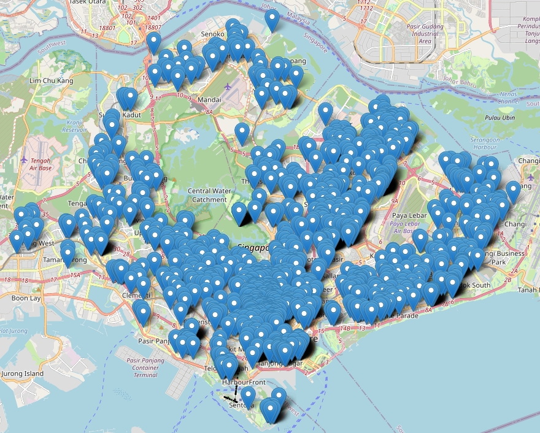
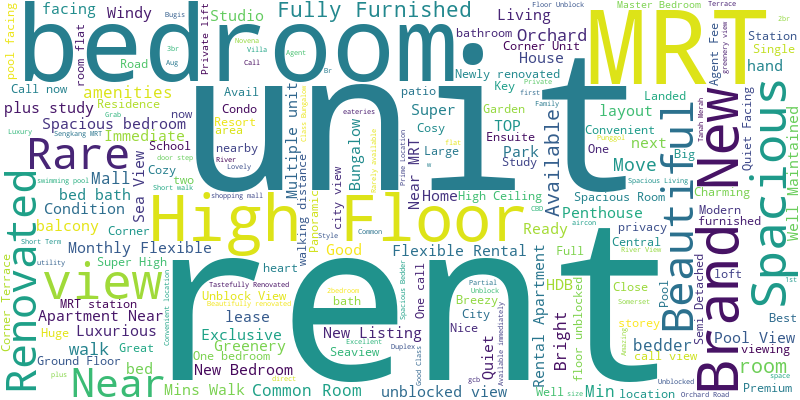
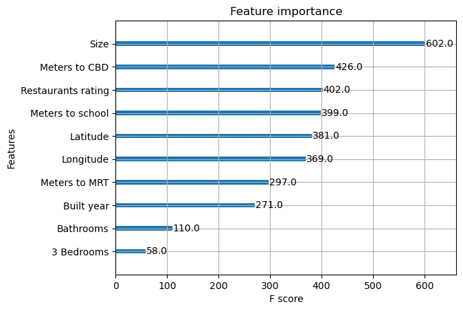
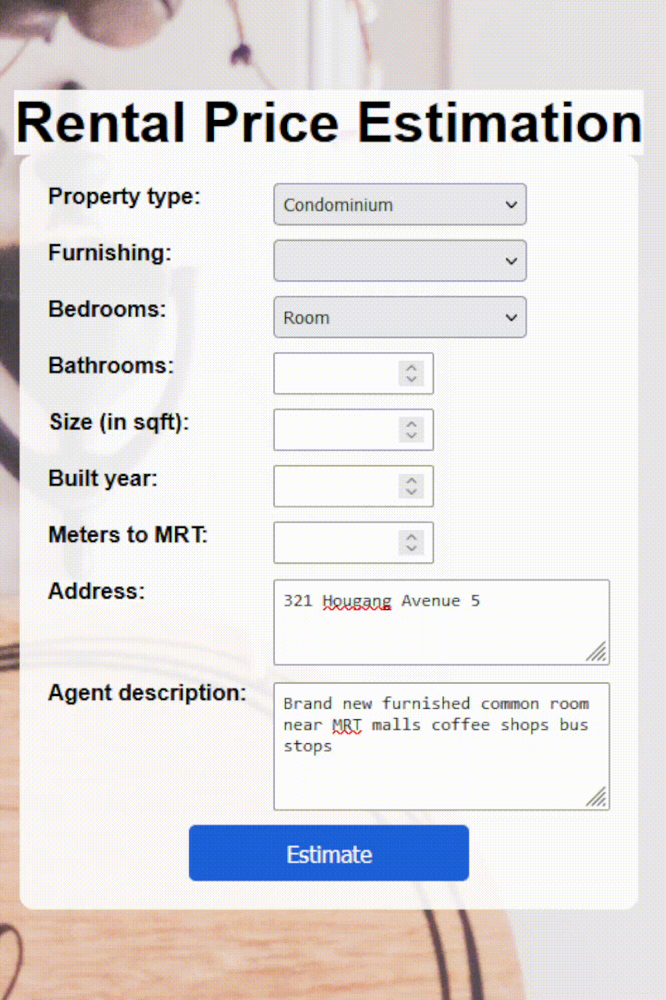

<!-- anchor tag for back-to-top links -->

<!-- PROJECT LOGO -->

  
  

     
    Scraped property listings from an online portal, engineered location-based features using Google Maps API, and trained various machine learning models. Deployed the XGBoost regression model with optimized hyperparameters (RMSE=995, MAPE=0.13, R²=0.90) as a web application.
     
  

 

---

<!-- TABLE OF CONTENTS -->
## Table of Contents
<ol>
  <li>
    <a href="#summary">Summary</a>
    <ul>
      <li><a href="#built-with">Built With</a></li>
    </ul>
  </li>
  <li>
    <a href="#motivation">Motivation</a>
  </li>
  <li>
    <a href="#data-collection">Data Collection</a>
  </li>
  <li>
    <a href="#exploratory-data-analysis">Exploratory Data Analysis</a>
  </li>
  <li>
    <a href="#data-preprocessing">Data Preprocessing</a>
  </li>
  <li>
    <a href="#model-training">Model Training</a>
    <ul>
      <li><a href="#baseline-models">Baseline Models</a></li>
      <li><a href="#hyperparameter-tuning">Hyperparameter Tuning</a></li>
      <li><a href="#model-selection">Model Selection</a></li>
    </ul>
  </li>
  <li>
    <a href="#model-deployment">Model Deployment</a>
  </li>
  <li>
    <a href="#getting-started">Getting Started</a>
    <ul>
      <li><a href="#prerequisites">Prerequisites</a></li>
    </ul>
  </li>
  <li>
    <a href="#appendix">Appendix</a>
    <ul>
      <li><a href="#random-forest-hyperparameter-tuning">Random Forest: Hyperparameter Tuning</a></li>
      <li><a href="#xgboost-hyperparameter-tuning">XGBoost: Hyperparameter Tuning</a></li>
    </ul>
  </li>
</ol>

<!-- SUMMARY -->
## Summary
+ **Motivation**: Simplify the process of finding rental properties in Singapore's expensive real estate market by using machine learning to estimate rental prices. 
+ **Data Collection**: Scraped 1680 property listings from an online property portal, including information on price, size, address, bedrooms, bathrooms and more.
+ **Exploratory Data Analysis**: Visualized property locations on an interactive map, generated a word cloud to extract insights from property agent descriptions, and examined descriptive statistics, distributions, and correlations.  
+ **Data Preprocessing**: Handled missing address data and engineered location-related features using the Google Maps API, extracted property features from agent descriptions and systematically evaluated multiple outlier handling methods. 
+ **Model Training**: Trained five machine learning models with baseline configurations, selected an XGBoost regression model with optimized hyperparameters, and achieved a test dataset performance with an RMSE of 995, a MAPE of 0.13, and an R² of 0.90.
+ **Model Deployment**: Created a web application for serving the XGBoost model using the Flask framework. Containerized this application using Docker and successfully deployed the Docker container on render.com.

### Built With
* [![Python][Python-badge]][Python-url]
* [![NumPy][NumPy-badge]][NumPy-url]
* [![Pandas][Pandas-badge]][Pandas-url]
* [![Matplotlib][Matplotlib-badge]][Matplotlib-url]
* [![scikit-learn][scikit-learn-badge]][scikit-learn-url]
* [![Flask][Flask-badge]][Flask-url]
* [![Docker][Docker-badge]][Docker-url] 
* [![Jupyter Notebook][JupyterNotebook-badge]][JupyterNotebook-url]
* [![PyCharm][PyCharm-badge]][PyCharm-url] 

(<a href="#readme-top">back to top</a>)

<!-- MOTIVATION -->
## Motivation
+ **Problem**: The rental property market in Singapore stands as one of the most expensive in the world. Navigating through this challenging landscape to find a lucrative deal can be a daunting task. Determining whether a property listing represents a fair deal or is excessively priced poses a considerable challenge to prospective renters.
+ **Project Goal**: Simplify rental property search in Singapore, using machine learning to estimate rental prices and empower users to make informed decisions about listed properties being genuine opportunities or overpriced investments.

(<a href="#readme-top">back to top</a>)

<!-- DATA COLLECTION -->
## Data Collection
+ Scraped 1680 property listings in Singapore from an online property portal using cloudscraper and Beautiful Soup.
+ Collected information on property name, price, address, size, bedrooms, bathrooms, property type, furnishing, built year, distance to MRT, and agent description.

(<a href="#readme-top">back to top</a>)

<!-- EXPLORATY DATA ANALYSIS -->
## Exploratory Data Analysis
Visualized property locations on an interactive map of Singapore ([link here](https://jensbender.github.io/rental-price-prediction/map.html)) using Python's Folium library.   
  

Utilized a word cloud to visualize word frequencies in property agent descriptions, thus informing feature extraction.

Explored descriptive statistics, distributions and correlations. 

(<a href="#readme-top">back to top</a>)

<!-- DATA PREPROCESSING -->
## Data Preprocessing
+ **Data Enrichment**: Leveraged the Google Maps API to fill in missing addresses based on property names.
+ **Feature Engineering**: Utilized the Google Maps API to obtain (a) latitude and longitude based on the address, (b) distance to the central business district, (c) distance to the closest school, and (d) average rating of nearby restaurants.
+ **Feature Extraction**: Extracted property features (e.g., high floor, new, renovated) from property agent descriptions.
+ **Handling Outliers**: Compared three methods for dealing with outliers and found that removing outliers based on 1.5 times the interquartile range consistently outperformed both removing outliers based on 3 standard deviations and not removing outliers.

(<a href="#readme-top">back to top</a>)

<!-- MODEL TRAINING -->
## Model Training

### Baseline Models 
Implemented five machine learning models with baseline parameter configurations and evaluated model performance on the validation data based on root mean squared error (RMSE), mean absolute percentage error (MAPE), and R-squared (R²).

| Model                  | RMSE  | MAPE | R²             |
|------------------------|-------|------|----------------|
| Linear Regression      | 1369  | 0.21 | 0.83           |
| Support Vector Machine | 2087  | 0.33 | 0.60           |
| Neural Network         | 1370  | 0.19 | 0.83           |
| Random Forest          | 1110  | 0.15 | 0.89           |
| XGBoost                | 1151  | 0.15 | 0.88           |

### Hyperparameter Tuning
+ Identified random forest and XGBoost as the top two performers for hyperparameter tuning.
+ Employed grid search with 5-fold cross-validation to find the best hyperparameter combinations.
  + Random Forest Hyperparameter Tuning: [See details](#random-forest-hyperparameter-tuning)
  + XGBoost Hyperparameter Tuning: [See details](#xgboost-hyperparameter-tuning)

### Model Selection
+ Selected the model that demonstrated the best performance on the validation data. The chosen model was an **XGBoost** regression model with the following hyperparameters: 
  + n_estimators=300
  + max_depth=4
  + subsample=0.8
  + colsample_bytree=0.8
  + learning_rate=0.1
  + min_child_weight=3
  + gamma=0
+ Hyperparameter tuning improved the XGBoost model compared to its baseline configuration, resulting in the following performance metrics: 

  | Data                      | RMSE  | MAPE | R²   |
  |---------------------------|-------|------|------|
  | Training                  | 279   | 0.05 | 0.99 |
  | Validation                | 1040  | 0.14 | 0.90 |
  | Test                      | 995   | 0.13 | 0.90 |

+ The **feature importance plot** highlights the top ten predictors of rental prices, with property size being the most influential. Distance to the central business district, average rating of nearby restaurants, and distance to the closest school, all obtained through the Google Maps API, follow as critical features, emphasizing the importance of location in the real estate market.  

(<a href="#readme-top">back to top</a>)

<!-- MODEL DEPLOYMENT -->
## Model Deployment
Integrated the XGBoost model into a web application, leveraging the Flask framework, HTML, and CSS. Users can input property listing details and instantly receive an estimate of the monthly rental price. Containerized the application using Docker and Docker Hub, culminating in a successful deployment on the render.com platform.

(<a href="#readme-top">back to top</a>)

<!-- GETTING STARTED -->
## Getting Started

### Prerequisites
This is a list of the Python packages you need.  
+ Data Collection
  + Cloudscraper
  + Beautiful Soup
  + lxml
  + Pandas
+ Data Preprocessing
  + NumPy
  + Pandas
  + Matplotlib
  + Seaborn
  + Requests
  + Dotenv
+ Model Training
  + NumPy
  + Pandas
  + Matplotlib
  + Scikit-learn
  + XGBoost
  + Pickle
+ Model Deployment  
  + Flask
  + WTForms
  + Requests
  + Dotenv
  + NumPy
  + Pandas
  + Scikit-learn
  + XGBoost
  + Pickle
 

(<a href="#readme-top">back to top</a>)

<!-- APPENDIX -->
## Appendix
### Random Forest: Hyperparameter Tuning
| Hyperparameter | Explanation  | Values |
|----------------|--------------|--------|
| n_estimators   | Number of decision trees in the forest                | [200, 300, 400, 500] |
| max_depth      | Maximum depth of each decision tree            | [20, 30, 40, 50] 
| max_features   | Maximum number of features considered when splitting a node | [0.33, 0.5, 0.66, 1] |

### XGBoost: Hyperparameter Tuning
| Hyperparameter   | Explanation                                    | Values                   |
|------------------|------------------------------------------------|--------------------------| 
| n_estimators     | Number of trees                                | [100, 200, 300, 400, 500] |
| max_depth        | Maximum depth of each tree                     | [3, 4, 5] 
| subsample        | Fraction of samples used for fitting each tree | [0.8, 0.9, 1.0] |
| colsample_bytree | Fraction of features used for fitting each tree| [0.8, 0.9, 1.0] |
| learning_rate    | Rate at which the model adapts during training             | [0.01, 0.1] |
| min_child_weight | Minimum sum of instance weight (hessian) needed in a child | [1, 2, 3] |
| gamma            | Minimum loss reduction required when splitting a node      | [0, 0.1, 0.2] |

(<a href="#readme-top">back to top</a>)

<!-- MARKDOWN LINKS -->
[Python-badge]: https://img.shields.io/badge/python-3670A0?style=for-the-badge&logo=python&logoColor=ffdd54
[Python-url]: https://www.python.org/
[NumPy-badge]: https://img.shields.io/badge/numpy-%23013243.svg?style=for-the-badge&logo=numpy&logoColor=white
[NumPy-url]: https://numpy.org/
[Pandas-badge]: https://img.shields.io/badge/pandas-%23150458.svg?style=for-the-badge&logo=pandas&logoColor=white
[Pandas-url]: https://pandas.pydata.org/
[Matplotlib-badge]: https://img.shields.io/badge/Matplotlib-%23ffffff.svg?style=for-the-badge&logo=Matplotlib&logoColor=black
[Matplotlib-url]: https://matplotlib.org/
[scikit-learn-badge]: https://img.shields.io/badge/scikit--learn-%23F7931E.svg?style=for-the-badge&logo=scikit-learn&logoColor=white
[scikit-learn-url]: https://scikit-learn.org/stable/
[Flask-badge]: https://img.shields.io/badge/flask-%23000.svg?style=for-the-badge&logo=flask&logoColor=white
[Flask-url]: https://flask.palletsprojects.com/en/3.0.x/
[Docker-badge]: https://img.shields.io/badge/docker-%230db7ed.svg?style=for-the-badge&logo=docker&logoColor=white
[Docker-url]: https://www.docker.com/
[JupyterNotebook-badge]: https://img.shields.io/badge/Jupyter-F37626.svg?style=for-the-badge&logo=Jupyter&logoColor=white
[JupyterNotebook-url]: https://jupyter.org/
[PyCharm-badge]: https://img.shields.io/badge/pycharm-143?style=for-the-badge&logo=pycharm&logoColor=black&color=black&labelColor=green
[PyCharm-url]: https://www.jetbrains.com/pycharm/
