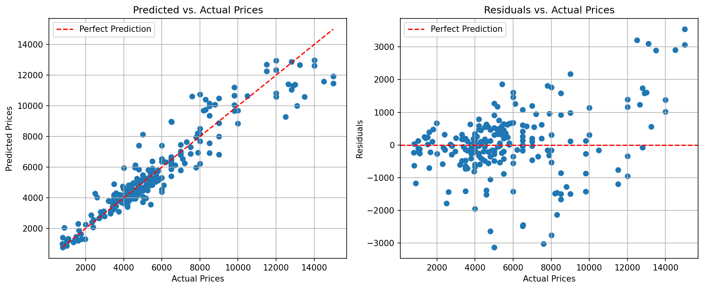

<!-- anchor tag for back-to-top links -->

<!-- PROJECT LOGO -->

  
  

     
    Estimate rental prices powered by machine learning.
     
  

 

---

<!-- TABLE OF CONTENTS -->
## Table of Contents
<ol>
  <li>
    <a href="#about-the-project">About The Project</a>
    <ul>
      <li><a href="#summary">Summary</a></li>
      <li><a href="#built-with">Built With</a></li>
    </ul>
  </li>
  <li>
    <a href="#motivation">Motivation</a>
  </li>
  <li>
    <a href="#data-collection">Data Collection</a>
  </li>
  <li>
    <a href="#exploraty-data-analysis">Exploratory Data Analysis</a>
  </li>
  <li>
    <a href="#data-preprocessing">Data Preprocessing</a>
  </li>
  <li>
    <a href="#model-training">Model Training</a>
    <ul>
      <li><a href="#baseline-model-performance">Baseline Model Performance</a></li>
      <li><a href="#hyperparameter-tuning-and-model-selection">Hyperparameter Tuning and Model Selection</a></li>
    </ul>
  </li>
  <li>
    <a href="#getting-started">Getting Started</a>
    <ul>
      <li><a href="#prerequisites">Prerequisites</a></li>
    </ul>
  </li>
  <li>
    <a href="#appendix">Appendix</a>
    <ul>
      <li><a href="#random-forest-hyperparameter-tuning">Random Forest: Hyperparameter Tuning</a></li>
      <li><a href="#xgboost-hyperparameter-tuning">XGBoost: Hyperparameter Tuning</a></li>
    </ul>
  </li>
</ol>

<!-- ABOUT THE PROJECT -->
## About The Project

### Summary
+ Motivation: Utilize machine learning to predict rental prices. 
+ Data collection: Scraped 1680 property listings from an online property portal in Singapore.
+ Exploratory data analysis: Visualized property locations on an interactive map of Singapore using Python's Folium library. Utilized a word cloud to inform feature extraction from property agent comments.  
+ Data preprocessing: 
  + Data enrichment: Filled in missing addresses based on property names using the Google Maps API.
  + Feature engineering: Utilized the Google Maps API to obtain (a) latitude and longitude based on the address, (b) distance to the central business district, (c) distance to the closest school, and (d) average rating of nearby restaurants.
  + Feature extraction: Extracted property type, furnishing, built year, distance to MRT and other features from the property descriptions.
  + Handling outliers: Removing rental price outliers based on 1.5 interquartile ranges improved model performance compared with removing outliers based on 3 standard deviations or not removing outliers.
+ Model training: 
  + Baseline model performance: XGBoost (RMSE: 1151) and random forest (RMSE: 1110) demonstrated superior performance compared to linear regression (RMSE: 1369), support vector machine (RMSE: 2087), and neural network (RMSE: 1370).
  + Hyperparameter tuning: Performed a grid search of XGBoost and random forest. 
  + Model selection: The best performing model was an XGBoost model with RMSE 995, MAPE 0.13 and R-squared 0.9 on the test data.

### Built With
* [![Python][Python-badge]][Python-url]
* [![NumPy][NumPy-badge]][NumPy-url]
* [![Pandas][Pandas-badge]][Pandas-url]
* [![Matplotlib][Matplotlib-badge]][Matplotlib-url]
* [![scikit-learn][scikit-learn-badge]][scikit-learn-url]

(<a href="#readme-top">back to top</a>)

<!-- MOTIVATION -->
## Motivation
+ Problem: The rental property market in Singapore stands as one of the most expensive in the world. Navigating through this challenging landscape to find a lucrative deal can be a daunting task. Determining whether a property listing represents a fair deal or is excessively priced poses a considerable challenge to prospective renters.
+ Project goal: Simplify the search process for individuals seeking rental properties in Singapore. This project harnesses the power of machine learning to create a tool that estimates rental prices and assists in making informed decisions about property listings. By doing so, this project aims to empower users with the ability to identify whether a listed property is a genuine opportunity or an overpriced investment.

(<a href="#readme-top">back to top</a>)

<!-- DATA COLLECTION -->
## Data Collection
+ Scraped 1680 property listings from an online property portal in Singapore using cloudscraper and Beautiful Soup.
+ Collected information on property name, price, address, size, bedrooms, bathrooms, property type, furnishing, build year, distance to MRT, and agent description.

(<a href="#readme-top">back to top</a>)

<!-- EXPLORATY DATA ANALYSIS -->
## Exploratory Data Analysis
+ Visualized property locations on an interactive map of Singapore using Python's Folium library. 
<iframe src="images/map.html" width="100%" height="400"></iframe>

+ Utilized a word cloud to visualize word frequencies in property agent comments, thus informing feature extraction. 

+ Explored descriptive statistics, distributions and correlations. 

(<a href="#readme-top">back to top</a>)

<!-- DATA PREPROCESSING -->
## Data Preprocessing
+ Data enrichment: Utilized the Google Maps API to fill in missing addresses based on property names.
+ Feature engineering: Utilized the Google Maps API to obtain (a) latitude and longitude based on the address, (b) distance to the central business district, (c) distance to the closest school, and (d) average rating of nearby restaurants.
+ Feature extraction: Extracted property type, furnishing, built year, distance to MRT, high floor, new unit, renovated, view, and penthouse from the property descriptions.
+ Handling outliers: Compared three ways of handling outliers in rental prices: (a) Removing outliers based on 1.5 interquartile ranges (IQR), (b) removing outliers based on 3 standard deviations (SD), and (c) not removing outliers. Removing outliers based on 1.5 IQR yielded the best performance on the validation data and was used for all subsequent models.

(<a href="#readme-top">back to top</a>)

<!-- MODEL TRAINING -->
## Model Training

### Baseline Model Performance 
+ Implemented linear regression, support vector machine regression, neural network regression, random forest regression, and XGBoost regression models with baseline parameter configurations. 
+ Evaluated model performance based on root mean squared error (RMSE), mean absolute percentage error (MAPE), and R-squared (R²).

| Model                  | RMSE  | MAPE | R²             |
|------------------------|-------|------|----------------|
| Linear Regression      | 1369  | 0.21 | 0.83           |
| Support Vector Machine | 2087  | 0.33 | 0.60           |
| Neural Network         | 1370  | 0.19 | 0.83           |
| Random Forest          | 1110  | 0.15 | 0.89           |
| XGBoost                | 1151  | 0.15 | 0.88           |

### Hyperparameter Tuning and Model Selection
+ Identified random forest and XGBoost as the top two performers for hyperparameter tuning.
+ Employed grid search with 5-fold cross-validation to find the best hyperparameter combinations.
  + Random forest: [See details](#random-forest-hyperparameter-tuning)
  + XGBoost: [See details](#xgboost-hyperparameter-tuning)
+ Selected the model with the best performance, which was an XGBoost model with the following hyperparameters: n_estimators=300, max_depth=4, subsample=0.8, colsample_bytree=0.8, learning_rate=0.1, and a min_child_weight=3, gamma=0.
+ Hyperparameter tuning improved the XGBoost model compared to the baseline configuration: RMSE: 1040 vs. 1151, MAPE 0.14 vs. 0.15, and R-squared 0.90 vs. 0.88. 

XGBoost Model Performance
| Data                      | RMSE  | MAPE | R²   |
|---------------------------|-------|------|------|
| Training                  | 279   | 0.05 | 0.99 |
| Validation                | 1040  | 0.14 | 0.90 |
| Test                      | 995   | 0.13 | 0.90 |

XGBoost Residual Plots for Test Data

XGBoost Feature Importance Plot 

(<a href="#readme-top">back to top</a>)

<!-- GETTING STARTED -->
## Getting Started

### Prerequisites
This is a list of the Python packages you need.  
+ Data collection
  + Cloudscraper
  + Beautiful Soup
  + lxml
  + Pandas
+ Data preprocessing
  + Numpy
  + Pandas
  + Matplotlib
  + Seaborn
  + Requests
  + Dotenv
+ Model training
  + Numpy
  + Pandas
  + Matplotlib
  + Scikit-learn
  + XGBoost
  + Pickle

(<a href="#readme-top">back to top</a>)

<!-- APPENDIX -->
## Appendix
### Random Forest: Hyperparameter Tuning
| Hyperparameter | Explanation  | Values |
|----------------|--------------|--------|
| n_estimators   | Number of decision trees in the forest                | [200, 300, 400, 500] |
| max_depth      | Maximum depth of each decision tree            | [20, 30, 40, 50] 
| max_features   | Maximum number of features considered when splitting a node | [0.33, 0.5, 0.66, 1] |

### XGBoost: Hyperparameter Tuning
| Hyperparameter   | Explanation                                    | Values                   |
|------------------|------------------------------------------------|--------------------------| 
| n_estimators     | Number of boosting rounds                      | [100, 200, 300, 400, 500] |
| max_depth        | Maximum depth of each tree                     | [3, 4, 5] 
| subsample        | Fraction of samples used for fitting each tree | [0.8, 0.9, 1.0] |
| colsample_bytree | Fraction of features used for fitting each tree| [0.8, 0.9, 1.0] |
| learning_rate    | Rate at which the model adapts during training             | [0.01, 0.1] |
| min_child_weight | Minimum sum of instance weight (hessian) needed in a child | [1, 2, 3] |
| gamma            | Minimum loss reduction required when splitting a node      | [0, 0.1, 0.2] |

(<a href="#readme-top">back to top</a>)

<!-- MARKDOWN LINKS -->
[Python-badge]: https://img.shields.io/badge/python-3670A0?style=for-the-badge&logo=python&logoColor=ffdd54
[Python-url]: https://www.python.org/
[NumPy-badge]: https://img.shields.io/badge/numpy-%23013243.svg?style=for-the-badge&logo=numpy&logoColor=white
[NumPy-url]: https://numpy.org/
[Pandas-badge]: https://img.shields.io/badge/pandas-%23150458.svg?style=for-the-badge&logo=pandas&logoColor=white
[Pandas-url]: https://pandas.pydata.org/
[Matplotlib-badge]: https://img.shields.io/badge/Matplotlib-%23ffffff.svg?style=for-the-badge&logo=Matplotlib&logoColor=black
[Matplotlib-url]: https://matplotlib.org/
[scikit-learn-badge]: https://img.shields.io/badge/scikit--learn-%23F7931E.svg?style=for-the-badge&logo=scikit-learn&logoColor=white
[scikit-learn-url]: https://scikit-learn.org/stable/
